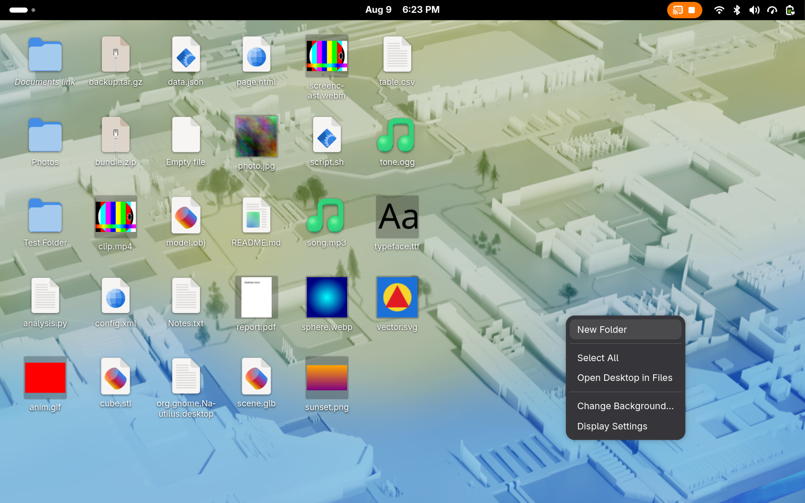

# Gnome Desktop Icons

File icons on the desktop for GNOME Shell 50, with the file operations handed to
Nautilus.

Nautilus stopped drawing the desktop in GNOME 3.28 and no Nautilus process can
paint it today. This extension draws the desktop itself but does not reimplement
the file manager behind it: copy, move, trash, rename and create-folder all go to
Nautilus over D-Bus, so you get its progress windows, its conflict dialogs, its
Properties window, and one undo stack shared with Files. Press Ctrl+Z in Files
and it undoes what you just did on the desktop.



## What it does

- Shows everything in `~/Desktop`, updated live as the folder changes
- Icons come from the shared MIME database and the active icon theme, so every
  file type looks the way it does in Files
- Thumbnails for images, video, SVG, PDF, fonts and anything else with a
  thumbnailer installed, written back to `~/.cache/thumbnails` so Files and
  every other GNOME app get them too
- A context menu that changes with what you click: the first entry names the
  application that will open the file, folders offer a terminal, pictures offer
  to become the wallpaper, and an untrusted launcher offers to be trusted
- Home, the wastebasket (empty or full) and mounted drives, each switchable
- Drag icons where you want them; positions are remembered per file, and per
  monitor. Drag files out to any application, and drop files, text or images in
- Sweep a rectangle over empty desktop to select; type a few letters to jump
- Rename with F2; run scripts in a terminal, as yourself or with sudo
- Open With lists everything registered for the type *and* everything else
  installed, with one switch to make the choice permanent
- Cut, copy and paste that interoperates with Files, sharing its undo stack
- Selection with click, Ctrl-click and Ctrl+A; arrow keys, Enter and Delete

The menus are deliberately short. Nothing appears in them that a keyboard
shortcut already covers, and nothing appears twice.

## Requirements

| | |
|---|---|
| GNOME Shell | 50 |
| Session | Wayland or X11 |
| Nautilus | optional — trash and new folder fall back to plain GIO without it |

## Install

```bash
make install        # symlink this checkout into ~/.local/share/gnome-shell/extensions
make schemas        # compile the GSettings schema
```

Then log out and back in. A running shell only scans the extension directories
at startup, so a newly installed extension cannot be loaded into the session you
are already in.

```bash
gnome-extensions enable gnome-desktop-icons@ned.tabulov.gmail.com
```

## How it is built

Two processes:

```
gnome-shell process          desktop-helper (GTK4, GJS)
  extension.js                 one transparent window per monitor
  helperProcess.js  <-------->  iconView.js     grid, selection, menus
  monitorTracker.js   socket    fileModel.js    Gio enumerate + monitor
  windowLayering.js             thumbnails.js   shared thumbnail cache
  shellCompat.js                nautilusOps.js  --D-Bus--> Nautilus
```

The split is not optional. Extension review forbids importing GTK into the shell
process, and cross-application drag-and-drop needs real GTK drag sources. Putting
the renderer in its own process also means file enumeration and thumbnailing
cannot freeze the compositor, and a crash there is survivable — the extension
restarts the helper with a backoff.

The helper's windows are ordinary Wayland toplevels. The extension turns them
into desktop windows with `Meta.Window.set_type(DESKTOP)` and
`hide_from_window_list()`, both added in Shell 49, and positions them with
`move_resize_frame()` because a Wayland client cannot place itself.

IPC is line-delimited JSON over a Unix socket in `XDG_RUNTIME_DIR`, not over the
child's stdout. Thumbnailers and launched applications inherit fd 1 and some of
them print to it; one chatty thumbnailer is enough to corrupt a protocol that
lives there.

## Development

The shell cannot be restarted on Wayland, so all iteration happens in a nested
shell with its own bus and its own configuration.

```bash
sudo dnf install mutter-devkit          # --devkit is the only nested mode on Shell 50

export DBUS_SESSION_BUS_ADDRESS=$(dbus-daemon --session --fork --print-address)
XDG_CONFIG_HOME=/tmp/di/config GSETTINGS_BACKEND=keyfile \
  GNOME_DESKTOP_ICONS_DEBUG=1 \
  gnome-shell --devkit --wayland --wayland-display=probe-wl
```

Which extensions load is controlled by `enabled-extensions` in
`$XDG_CONFIG_HOME/glib-2.0/settings/keyfile`, which keeps the throwaway shell
from loading your real session's extensions.

Three environment variables help, all silent unless set:

| Variable | Effect |
|---|---|
| `GNOME_DESKTOP_ICONS_DEBUG=1` | trace lifecycle, geometry and layering to the journal |
| `GNOME_DESKTOP_ICONS_DEBUG_SHOT=<path>` | close the overview and write a screenshot of the stage |
| `GNOME_DESKTOP_ICONS_DEBUG_CLICK=x,y[,button]` | click that spot first — the only way to drive a nested shell |

```bash
make check     # parse every source file as an ES module
make lint      # eslint, after npm install
make helper    # run the helper alone, in one ordinary window
make pack      # build the zip for extensions.gnome.org
```

A note on this machine class: GIO file monitors fail with `Unable to find
default local file monitor type` when the kernel's inotify instance limit is
exhausted, which a few editors and sync clients manage on their own. The desktop
still lists files, it just stops updating live.

```bash
sudo sysctl -w fs.inotify.max_user_instances=1024
```

## Status

Working: the grid, icons, thumbnails, selection including rubber-band and
type-ahead, keyboard, context menus, the Nautilus operations, drag-and-drop,
clipboard, saved icon positions, Home/wastebasket/volumes, rename, running
scripts, preferences, and translation plumbing (`make pot`).

Translated into German. `make pot` refreshes the catalogue template; new
languages are a `locale/xx.po` away.

Not yet: no rubber-band or drag-out verification with a real mouse. See
`PLAN.md` for the rest, and `SUBMISSION.md` for the extensions.gnome.org
checklist.

## Author

Shahab Nedaei <ned.tabulov@gmail.com>

## License

GPL-2.0-or-later. See [LICENSE](LICENSE).
